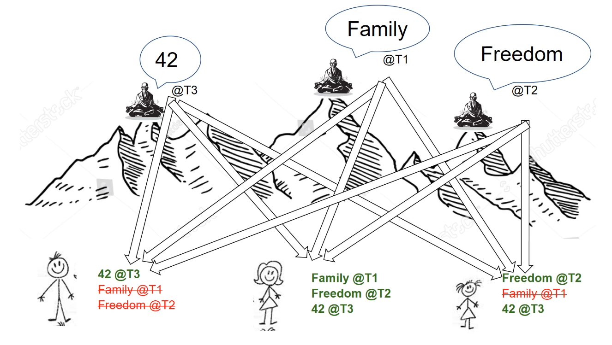
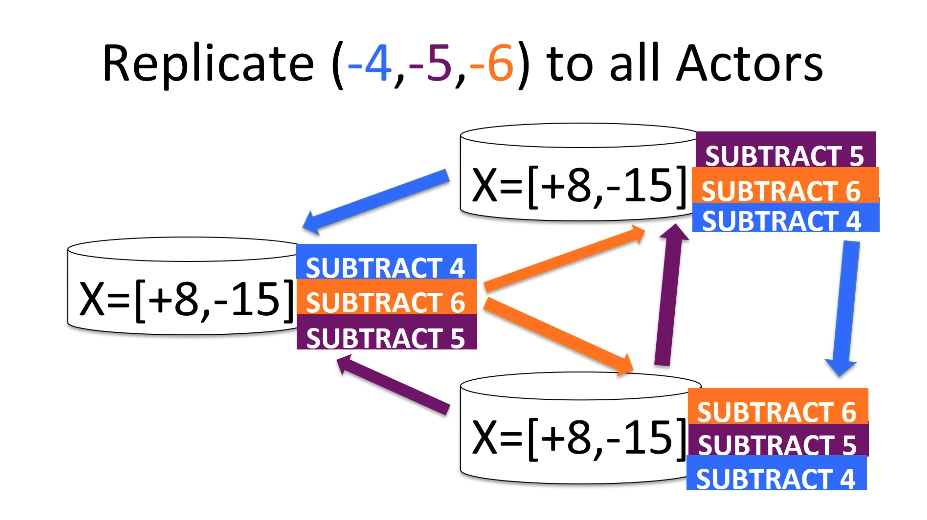
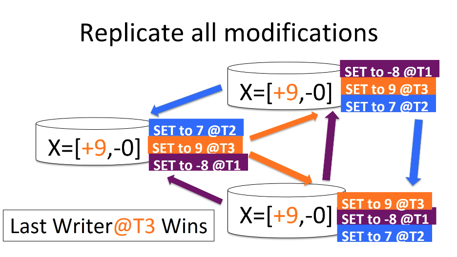
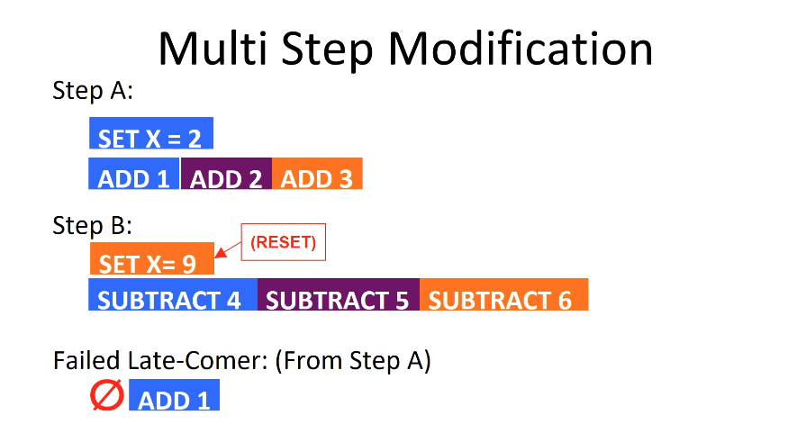
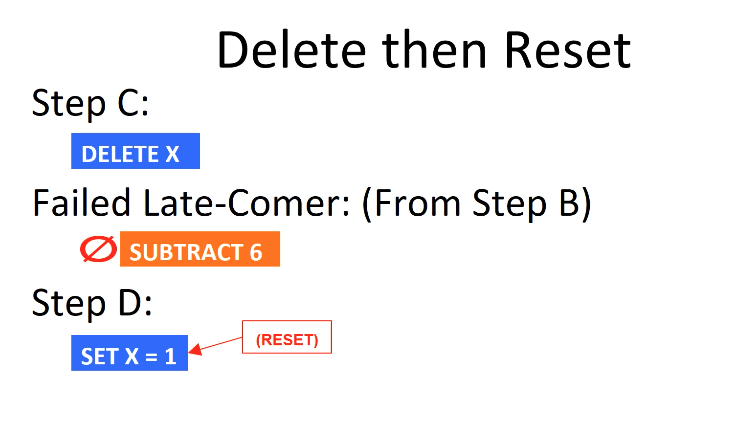
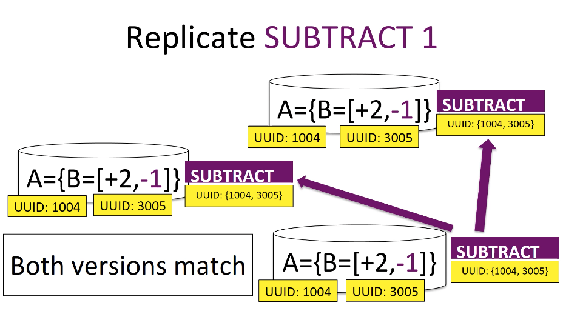
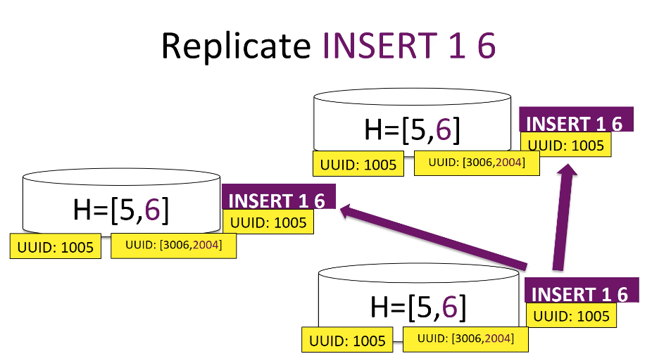
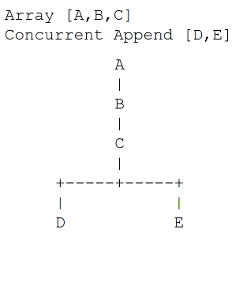
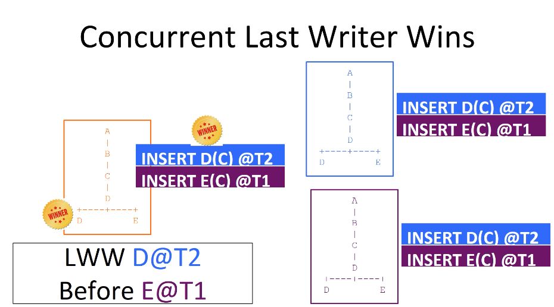
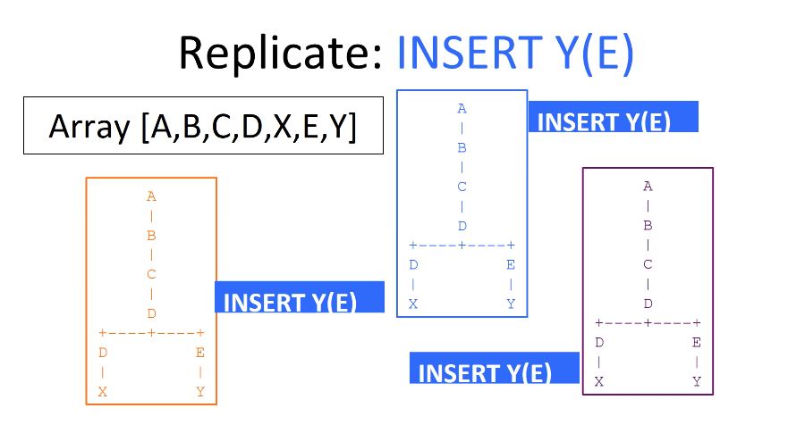

# CRDT Introduction

Autonomous actors replicate to one another in a lock-free, wait-free, consensus-free manner and still converge to the same consistent state.

Strong Eventual Consistency: Over time all actors converge to same state without date loss.

Replication as Commutative Operation. Order of Replication does not matter.

Commutative Replication works for all JSON.

```js
{
  string: "abc", // set, delete
  number: 123, // set, delete, increment
  object: {...}, // set, delete
  array: [...] // set, delete, insert
}
```

Set Operation, Convergent
All actors converge to the same state, but values during convergence may differ.
Last-Writer-Wins



Operations:

1. Decrement Counter
2. Set Counter
3. Set then Reset
4. Delete then reset
5. Objects
6. Arrays
7. Concurrent Inserts
8. Causal+Consistency

## Decrement Counter

Use two counters, one for + one for -
Start with 3 actors, all at X=[+8, -0]
Each actor autonomously decrements X, the operation is commutative.



It converges to -7.

## Set Counter

Using last writer wins



## Multi step modification



All field have a UUID, Field-UUID versioning detects race conditions.

Versioning holds the state commutative algorithms require to be able to autonomously resolve conflicts and converge to the same state without using consensus.

Versions and Vector Clocks
Document:

## Delete then reset

A delete operation retires a UUID.
Once applied, all subsequent operations with this UUID are ignored.



## Objects



Need to both specify the object UUID, and the field UUID.

## Arrays

Initialized with set operations.
Operation insert grows the array with a positional insert.



## Concurrent Inserts

Array-odering is a reverse-linked-list with linkage via Left-Hand-Neighbors(LHN).
The Array [A,B,C] is represented [A<-B<-C]
Insert with same LHN are internally sorted via LWW.
Internal representation of array with concurrent inserts is a tree.





We traverse the tree using left first DFS.



## Causal+Consistency

CRDTs provide: Causal consistency + convergent conflict handling
Causal means events in chain logically precede one another: (e.g. Born -> Live -> Die)
Causality is in each Delta as a vector clock of size number of actors.
Queue Deltas until causal chain is complete, then apply.

## References:

-   [CRDTs explained](https://www.serverless.com/blog/crdt-explained-supercharge-serverless-at-edge)
